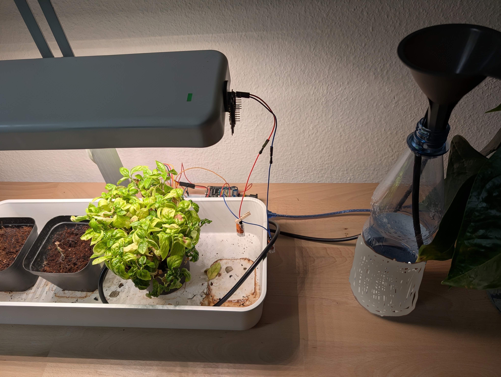
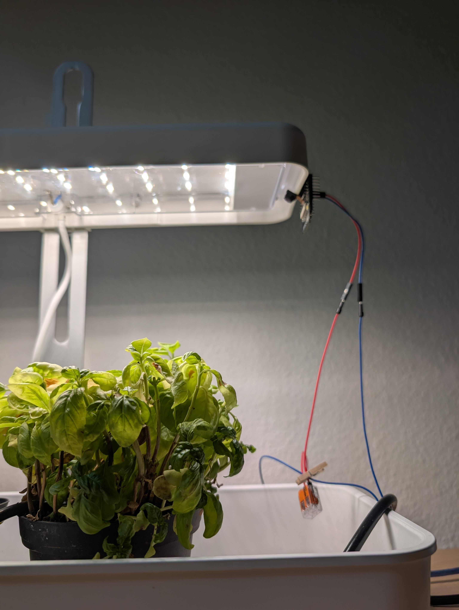
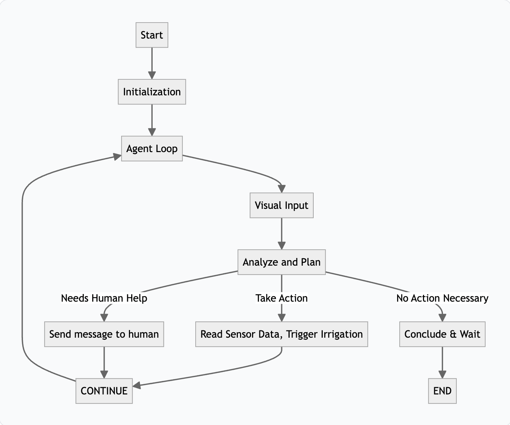

# Agent Basil

An experimental AI agent taking care of a basil plant.


Image created with Google Gemini.

## About The Project

This project is an experiment to create an AI agent that can take care of a basil plant. The agent uses a combination of AI technologies to monitor the plant's health and provide it with the care it needs.

### Built With

*   [LangGraph](https://github.com/langchain-ai/langgraph)
*   [FastMCP](https://github.com/jlowin/fastmcp)
*   [Google Gemini](https://ai.google.dev/)

## Getting Started

To get a local copy up and running follow these simple steps.

### Prerequisites

- This project uses [Pixi](https://pixi.sh/) to manage dependencies. You will need to have it installed on your system.
- This project depends on two local APIs being available in your network and the hardware being connected to them:
    - [ESP-32-CAM-REST-API](https://github.com/dominik-reiner/esp32-cam-rest-api)
    - [ESP-8266-IRRIGATION-REST-API](https://github.com/dominik-reiner/esp8266-irrigation-rest-api)
- In summary you will need:
   - An ESP-32-CAM
   - An ESP-8266 with:
        - A relay module
        - A water pump (I use a small 5V water pump)
        - Some water tubes 
        - A soil moisture sensor
        - A AHT20 temperature and humidity sensor
        - A breadboard and some jumper wires
        - A water reservoir (I use a small plastic bottle)
   - A basil plant to take care of (Mine is placed in a pot under a grow light)
- Make sure the ESP-32-CAM has a good view of the plant and is able to take pictures of it.
- Stick the soil moisture sensor into the soil of the plant.
- Attach the water pump to the water reservoir and stick the tube into the soil of the plant.




### Installation

1. Clone the repo
2. Copy `.env.example` to `.env` and fill in your API keys
    ```sh
    cp .env.example .env
    ```
3. Install dependencies
    ```sh
    pixi install
    ```

## Usage

To run the agent, you will need to have a `.env` file in the root of the project with the following content:

```
GEMINI_API_KEY="YOUR_API_KEY"
```

You can then run the agent with the following command:

```sh
pixi run start
```

In the terminal you will see the agent's thoughts and actions as it takes care of the plant.
The agent will monitor the plant's health and provide it with the care it needs.
Once it decides there is nothing more it can do, it will either send a message to the human caretaker (You)
or determine that it is done for now.

## How It Works



The agent's logic is built around a state machine powered by LangGraph. Here's a step-by-step breakdown of the process:

1.  **Initialization**: The application starts two main services:
    *   **MCP Servers**: `FastMCP` servers are launched to create a bridge between the agent's tools and the hardware APIs (ESP32-CAM for images and ESP8266 for sensor data and irrigation). These servers dynamically generate tools for the agent based on a simple OpenAPI specification.
    *   **Agent Graph**: The main agent logic, built as a LangGraph graph, is initialized. It gets its tools from the MCP servers and includes other custom tools. (Sending messages to the human caretaker, waiting for a minute)

2.  **Agent Loop**: The agent operates in a loop, continuously assessing and addressing the plant's needs.
    *   **Visual Input**: The loop begins with capturing an image of the basil plant using the ESP32-CAM.
    *   **Hypothesis**: The image is passed to the LLM model along with a detailed prompt that instructs it to act as a botanist. Based on the visual information, the agent forms a hypothesis about the plant's current condition (e.g., "The leaves are drooping, so the soil might be dry.").
    *   **Investigation**: To confirm or deny its hypothesis, the agent uses its tools to gather more data. It can check the soil moisture, temperature, and humidity using the sensors connected to the ESP8266.
    *   **Action**: Once the agent has a confident diagnosis, it decides on the best course of action. This could be:
        *   Watering the plant by triggering the irrigation system.
        *   Sending a specific task to the human caretaker if it identifies a problem it can't solve on its own (e.g., pests, temperature issues).
        *   Concluding that the plant is healthy and no action is needed at the moment.
    *   **Termination**: The agent's turn ends when it determines no further action is required, waiting for the next invocation.

This cycle allows the agent to autonomously monitor and care for the basil plant, combining visual analysis with sensor data to make informed decisions.

## License

This project is licensed under the **MIT License**. For more information, please see the [LICENSE](LICENSE) file.

This project uses various third-party libraries. A list of these libraries and their respective license notices can be found in the [NOTICE](NOTICE) file.
